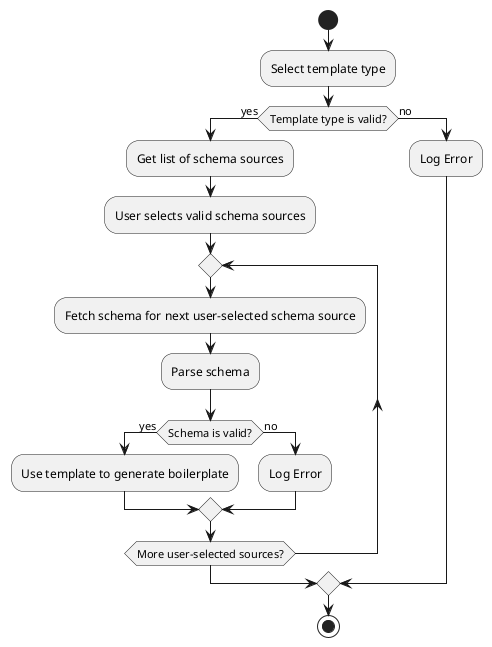

Pipeline

Following steps to be followed on bilerplate generation.

## Process Diagram Description

Here is a detailed flow of the steps in the process.

### 1. Start

The process begins.

### 2. Select Template Type

You select the type of template to be used for generating the boilerplate code.

### 3. Verify Template Type

The system checks if the selected template type is valid. If it's not valid, an error is logged, and the process is stopped.

### 4. Get List of Schema Sources

All potential schema sources are retrieved.

### 5. User Selects Valid Schema Sources

From the list of all schema sources, the user selects the valid sources for which the boilerplate code needs to be generated.

### 6. Loop Through Each User-Selected Source

For each user-selected schema source, the following steps are taken:

#### 6.1. Fetch Schema For Next User-Selected Schema Source

The system fetches the schema for the next selected source from the list.

#### 6.2. Parse Schema

The fetched schema is parsed.

#### 6.3. Verify Schema

The parsed schema is checked for validity. If the schema is not valid, an error is logged and the process moves on to the next selected schema source.

#### 6.4. Use Template To Generate Boilerplate

If the schema is valid, the previously selected template type is used to generate the boilerplate code. After this, the process moves on to the next selected schema source.

### 7. Repeat While

The loop in Step 6 continues until all user-selected sources have been processed. After all sources have been processed, it moves to the next step.

### 8. Stop

The process is stopped after all the selected schema sources have been processed.

**Note:** This process flow assumes that schema fetching, parsing, and boilerplate generation will not throw any unhandled exceptions that might disrupt the flow. Depending on your specific process and error handling strategies, you may want to further modify this flow.
